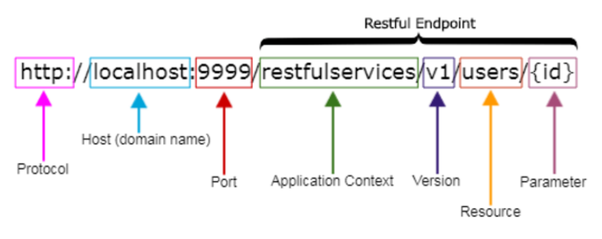

# REST API

## Naming conventions

 

1. Use nouns to represent resources, not verbs;
2. Use pluralized nouns for resources;
3. Use hyphens (`-`) to improve the readability of URIs;
4. Use forward slashes (`/`) for hierarchy but not trailing forward slash;
5. Avoid using file extensions;
6. Version your APIs;
7. Use query component to filter URI collection (parameters should be passed after the `?`).

 <b>Additional notes:</b>

- The URIs are named with nouns to specify the resource instead of using verbs;
- The URIs should not indicate any CRUD (create, read, update, delete);
- Avoid verb-noun combinations;
- Use plural when possible unless they are singleton resources;
- Avoid using underscores in the URIs;
- Forward slashes are used to show the hierarchy between individual resources and collections;
- Enable sorting, filtering, and pagination in the resource collection API and give the input parameters as query parameters to meet this requirement.
  
 

 

**Main sources:**

- https://medium.com/@nadinCodeHat/rest-api-naming-conventions-and-best-practices-1c4e781eb6a5
